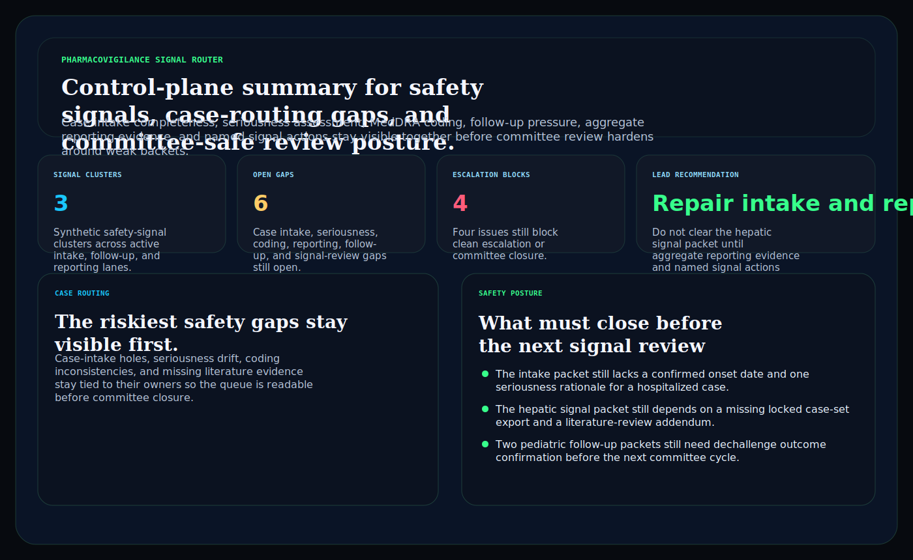
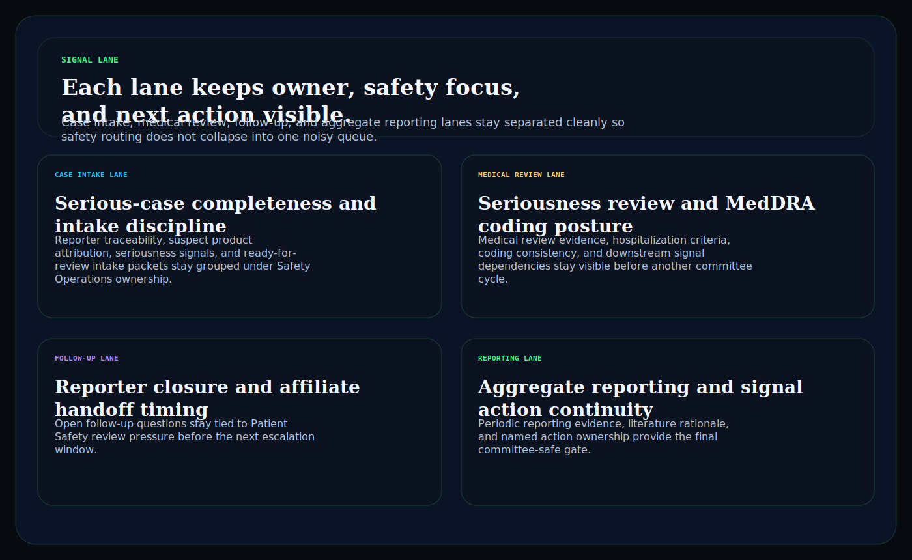
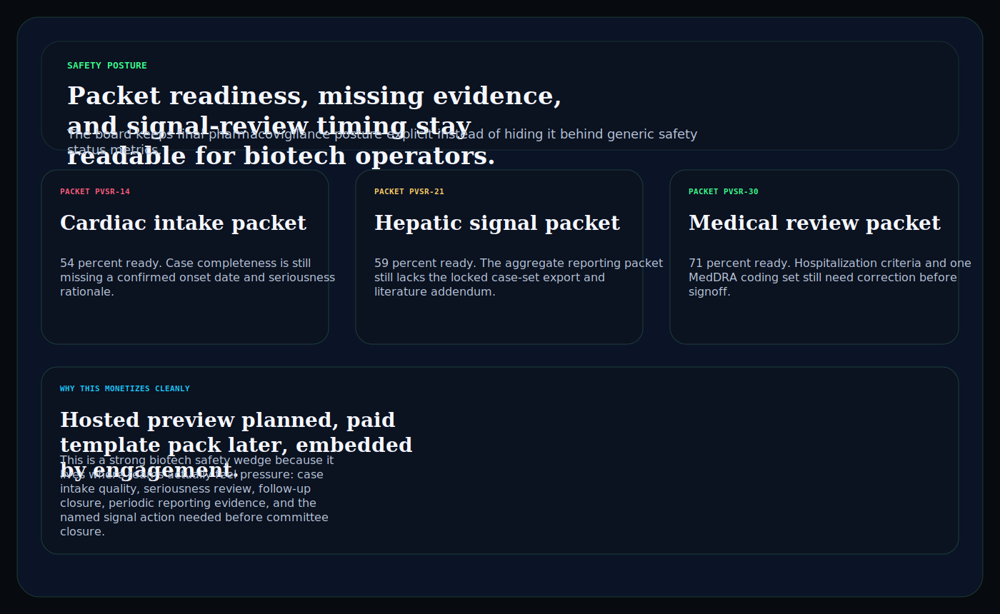

# pharmacovigilance-signal-router

C# / ASP.NET operator surface for biotech pharmacovigilance signals, case-routing gaps, follow-up pressure, aggregate reporting evidence, and committee-safe review posture.

## Why this matters

Biotech and diagnostics teams do not need another vague safety landing page. They need a board that keeps case intake quality, seriousness review, MedDRA coding, follow-up closure, aggregate reporting evidence, and named signal actions visible together before weak packets slip into downstream committee review.

This repo is the public proof surface for that pattern:

- `Hosted preview planned` for a browser-based pharmacovigilance signal router
- `Embedded by engagement` for teams that need the routing model inside a regulated drug-safety or diagnostics workflow

## What it includes

- ASP.NET Core minimal API in C#
- synthetic safety snapshots, case-routing gaps, and committee packets
- operator surfaces for:
  - `/signal-lane`
  - `/case-routing`
  - `/safety-posture`
  - `/verification`
  - `/docs`
- structured JSON endpoints under `/api/*`
- static Pages export with `robots.txt`, `sitemap.xml`, and `CNAME`

## Screenshots





## Verification

- synthetic pharmacovigilance evidence only
- no patient-identifiable, clinician, or sponsor-confidential safety data
- no claim of GVP, FDA, EMA, or pharmacovigilance compliance
- this is a control-plane proof surface for biotech safety-workflow depth, not a compliance certification claim

## Local run

```powershell
dotnet test
dotnet run --project src/PharmacovigilanceSignalRouter.Api -- --demo
dotnet run --project src/PharmacovigilanceSignalRouter.Api
```

Then open:

- `http://127.0.0.1:5094/`
- `http://127.0.0.1:5094/signal-lane`
- `http://127.0.0.1:5094/case-routing`
- `http://127.0.0.1:5094/safety-posture`

## Render static site

```powershell
dotnet run --project src/PharmacovigilanceSignalRouter.Api -- --prerender
```

## Related docs

- [Embedded framing](./docs/KINETIC_GAIN_EMBEDDED.md)
- [Origin story](./docs/ORIGIN.md)
